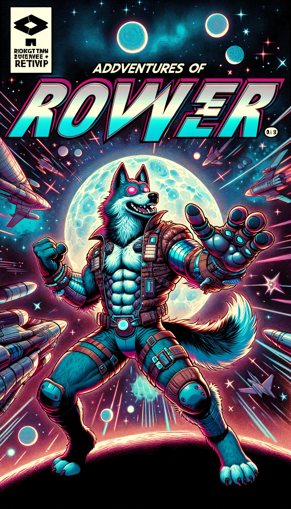

I don't know how long this series will go, but I need a way to document how AI is changing the way I work and if I'm honest, the way I think.  I'm going to start way back when I was dipping my toe into the AI development world.  Compared to what I do today, it feels very primitive.  Enough table setting.  Here we go...

I realized I could at least attempt to use chatGPT to code when I was able to type a prompt that went something like this: "Write a golang program that is an HTTP server that serves up a rest API for a simple movie database.  A POST accepts json that has values for title, director and year of release and returns a json ID, a GET accepts the ID, and first checks in a redis server for the data and returns it as json, if it's not there, pull from mysql, write it to redis with a TTL of 30 seconds, and then return the json in the response."  The code worked just like I asked it to.  It made the .sql files to create the tables as well as indexes.  It came up with 404 messages, all that.  I probably made 1 or 2 changes.

During these initial phases of LLM coding I had a lot of work to do with DynamoDB and Go.  At the time (this would've been mid 2023) The documentation around it wasn't great.  There were SDKs but the best ones were built for other languages.  So I would literally take small sections of code, paste into ChatGPT along with whatever error messages I was getting and then...boom, a fix appeared.  I was very nervous about using code that I didn't write.  But most of the time it worked.  In those early days chatGPT would sometimes reference modules that I did not use and I'd have to say, "No, use this or that module that's already in the project."  Sometimes it would reference modules that did not exist.  That was rough because I'd think, "Oh someone already solved that problem!  Great I can import...oh...this is what the module _might_ be called if someone ever gets around to making it :(.  But this approach helped a lot.  

  * Copy from VS Code
  * Paste to chatGPT, get a result
  * Copy from chatGPT
  * Paste to VS Code  
  
  Smashed a lot of bugs really fast.  But that was about the extent of what I did.  It was small code changes that saved me a trip to Stack Overflow, only they were written to _my exact problem_ rather than one sort of like it.

  I took this to another level when I started a side project for an iPhone/iPad app.  I had very little experience with XCode, Swift and Swift UI.  I bought a udemy course to learn, but I wasn't making enough progress so I started describing forms in chatGPT and copy/pasting the resulting Swift code into Xcode.  I did learn quite a bit about iOS development during that process even though I didn't write that much of the UI code.  I just described what the form should do and I knew a lot about how the backend worked with Firebase so I could describe those actions pretty well.  I ended up using that `describe as input, copy the output` approach to build the entire app.  It was a comicbook reader that had create account, login, a list with thumbnails and titles for the comic book series, a list of all the books in that series, and then a fully functioning comic book reader that would let you tap to zoom each panel.  You could view page by page or a smoothly transitioning panel by panel.  I had to help chatGPT with the math for the zooming, but it wrote almost all of it.  

  Where did the coordinates for the panels on the page come from?  I copy/pasted my way with chatGPT to create a panelizer web tool.  Where did the comic books come from?  I had chatGPT make images and the first few pages for three made up series, R0V3R the Space Dog, Samurai Susan and Bill the Bug Hunter.  Yep, copy/pasting from chatGPT into XCode and VS Code gave me some really helpful tools.  I had to keep the files small because the context windows weren't that big and the files had _NO_ knowledge of each other so that was something I had to keep in mind, but it all worked and it all worked way faster than it would have had I written it all myself.  The only thing I paid for was the $20/month subscription to OpenAI. I got a universal(iPhone/iPad) comic book app, a panelizer tool for images and all the fake data I needed.

  As helpful as those tools were, I would never work that way now.  Things have come a long, _long_ way.  But that's for future posts.

  Here are some links to a demo of the app...

  * [iPad Demo](https://youtu.be/gcdg4RiT1OU)
  * [iPhone Demo](https://youtube.com/shorts/OtD0w0qwH7I)

  Here are the covers:

  
  
  

   
All text written by me with _minor_ spelling/grammar changes from Claude.  All images created by chatGPT.